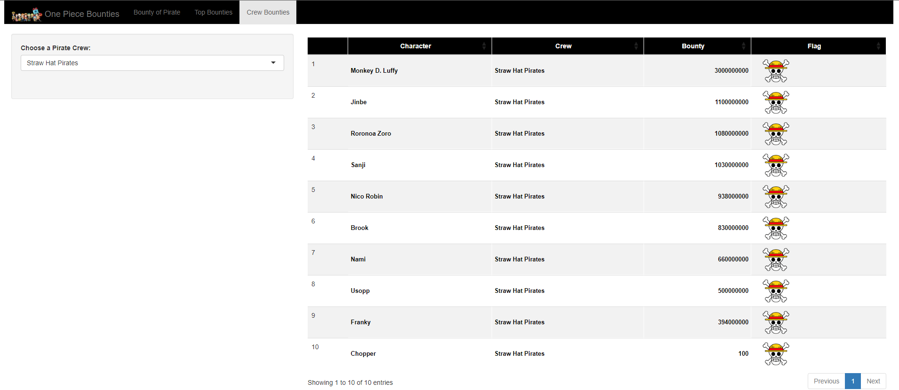

# One Piece Bounties Web Application

Before I started my adventure in Data Science, I was working as a subtitle translator. One of the series I translated was One Piece. Now, while learning data science spells, I wanted to go back and make a connection with my previous work, so I made a web application. If you love the legendary One Piece like me, this web application is for you!

With this application, you can access the current bounty values of most of the characters in the series (164 of them) in Berry units! In addition to the bounty value of each pirate, you can also sort by bounty ranking and the crew the pirate belongs to with this web application consisting of three different pages.

I created [the data set](https://github.com/ozturkfemre/OnePiece/blob/main/OnePiece/dataset/OnePieceBounties.xlsx) used in the application and we can use the data set as you wish.

You can access the application from [here](https://ozturkfemre.shinyapps.io/OnePieceBounties/) and you can examine it as you wish.

Here is a preview of the app:

